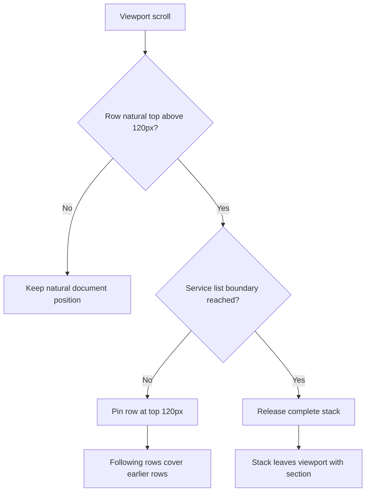

# Velora motion reverse report

## Ringkasan

Runtime situs referensi diinspeksi melalui Chrome DevTools Protocol pada viewport `1440x900`, `810x900`, dan `390x900`. Temuan utama adalah service section memakai native sticky stacking pada semua breakpoint dan Reviews memakai slideshow tiga halaman tanpa autoplay.

## Evidence, finding, path

| Evidence | Finding | Implementation path |
| --- | --- | --- |
| Service row ancestor memiliki `position: sticky; top: 120px` pada ketiga viewport | Row harus menumpuk saat melewati `y=120`, kemudian dilepas oleh batas bawah list | Terapkan sticky langsung pada `.service-row`; jangan memakai normal flow atau loop transform JS |
| Desktop/tablet row berukuran `204px` dengan natural pitch `205px`; mobile sekitar `295px` dengan pitch `296px` | Separator berada pada ruang `1px` antarrow, bukan menambah tinggi row | Gunakan `margin-top:1px` dan pseudo-element separator |
| Saat `scrollY=2750`, dua desktop row pertama sama-sama berada di `top=120px` | Efek pada screenshot adalah pile/overlap yang disengaja | Pertahankan background putih tiap row agar row berikutnya menutup row sebelumnya |
| Framer slideshow memiliki tiga item, gap `10px`, card desktop sekitar `611px` dalam viewport `678px` | Local marquee 12-card dan autoplay tidak sesuai | Gunakan tiga card, pagination dots, pointer drag, dan transition satu halaman |
| Transform slideshow tidak berubah selama observasi idle empat detik | Tidak ada autoplay | Hapus animation-frame marquee loop |
| Hero appear metadata berisi spring stiffness `400`, damping `58`, mass `1`, delays `0/.1/.2/3s` | Delay harus diterapkan, bukan hanya dibaca dari dataset | Teruskan `delay` ke GSAP dan gunakan spring-like easing |

## Reproduction

Raw runtime evidence dibuat dengan Node built-in `WebSocket` terhadap Chrome CDP di port lokal `9223`. Data observasi tersimpan selama sesi di:

- `/tmp/opencode/velora-live-service-runtime.jsonl`
- `/tmp/opencode/velora-live-service-responsive.jsonl`
- `/tmp/opencode/velora-live-carousel-runtime.json`
- `/tmp/opencode/velora-live-carousel-click.json`

## Behavior diagram

## Verification

- Service row height: `204px` desktop/tablet and `295px` mobile.
- Sticky offset: `120px` at all tested breakpoints.
- Section geometry remains unchanged from the measured reference baseline.
- Reviews track remains stationary while idle and moves one card after pagination activation.
- Browser runtime reported no JavaScript exceptions.
- `npm run build` exits successfully.

## Deliberate differences

The slideshow transition uses a CSS ease-out approximation rather than Framer's private runtime spring implementation. Trigger, direction, card pitch, idle behavior, pagination, and drag threshold match the observed interaction contract.
